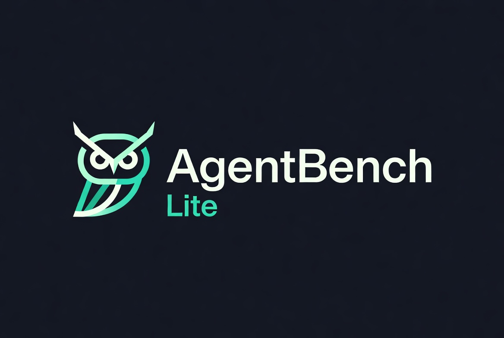

<div align="center">

# 

# AgentBench Lite

### Research-Focused Benchmarking Platform for LLM Agents & Tool-Using Systems

A lightweight but extensible platform for evaluating Large Language Models as autonomous tool-using agents across structured reasoning tasks, benchmark datasets, execution traces, and evaluation pipelines.

---


</div>

---

# Overview

Most current LLM evaluation systems only measure:

- Final answer accuracy
- Benchmark score
- Token usage

But modern LLM agents are significantly more complex.

They:
- reason step-by-step
- call external tools
- generate intermediate traces
- fail in multiple ways
- behave differently under execution pressure

Traditional benchmarks treat these systems like black boxes.

AgentBench Lite was built to solve that problem.

---

# Problem Statement

Current AI benchmarks fail to answer questions like:

| Problem | Traditional Benchmarks |
|---|---|
| How did the model reason? | ❌ |
| Which tools were used? | ❌ |
| Why did execution fail? | ❌ |
| Where was latency introduced? | ❌ |
| How efficient was the agent? | ❌ |
| Can execution be replayed? | ❌ |

This makes modern LLM-agent evaluation:
- opaque
- difficult to debug
- hard to reproduce
- difficult to analyze scientifically

---

# Solution

AgentBench Lite introduces a structured execution pipeline for LLM agents.

Instead of evaluating only outputs:

```text
Prompt → Final Answer
```

The platform evaluates:

```text
Prompt
   ↓
Reasoning
   ↓
Tool Selection
   ↓
Tool Execution
   ↓
Intermediate State
   ↓
Evaluation
   ↓
Execution Trace
   ↓
Analytics
```

---

# Core Features

| Feature | Description |
|---|---|
| Benchmark Datasets | Structured reasoning/task datasets |
| Tool Execution Engine | Real-time tool calling system |
| Agent Execution Loop | Multi-step autonomous execution |
| Replay Viewer | Full execution trace visualization |
| Evaluation Engine | Task scoring & grading |
| Analytics Dashboard | Charts & benchmark insights |
| Export System | CSV/JSON benchmark exports |
| Leaderboards | Model comparison system |
| Execution Traces | Reasoning + tool replay |
| Research Dashboard | Research-focused UX |

---

# System Architecture

```text
┌────────────────────────────────────────────┐
│                Frontend                    │
│        Next.js + TypeScript UI             │
└────────────────────────────────────────────┘
                     │
                     ▼
┌────────────────────────────────────────────┐
│               API Layer                    │
│               FastAPI Backend              │
└────────────────────────────────────────────┘
                     │
        ┌────────────┼────────────┐
        ▼            ▼            ▼

┌──────────────┐ ┌──────────────┐ ┌──────────────┐
│ Benchmark    │ │ Execution    │ │ Analytics    │
│ Engine       │ │ Engine       │ │ System       │
└──────────────┘ └──────────────┘ └──────────────┘

        │            │            │
        ▼            ▼            ▼

┌──────────────┐ ┌──────────────┐ ┌──────────────┐
│ Tool Calling │ │ Replay Trace │ │ Evaluation   │
│ System       │ │ System       │ │ Engine       │
└──────────────┘ └──────────────┘ └──────────────┘
```

---

# Tech Stack

## Backend

| Technology | Purpose |
|---|---|
| FastAPI | Async API backend |
| Pydantic | Validation & schemas |
| Uvicorn | ASGI server |
| aiofiles | Async dataset loading |
| Groq API | LLM inference |
| OpenRouter | Multi-provider inference |

---

## Frontend

| Technology | Purpose |
|---|---|
| Next.js 14 | Frontend framework |
| TypeScript | Type-safe frontend |
| TailwindCSS | UI styling |
| shadcn/ui | Component system |
| Recharts | Analytics visualizations |

---

# Benchmark Execution Flow

```text
User selects benchmark
          ↓
Frontend sends execution request
          ↓
Backend creates execution session
          ↓
Model receives task
          ↓
Agent reasoning loop starts
          ↓
Tool calls executed
          ↓
Intermediate traces stored
          ↓
Evaluation engine scores execution
          ↓
Analytics updated
          ↓
Replay trace generated
          ↓
Frontend renders results
```

---

# Benchmark Pipeline

| Stage | Purpose |
|---|---|
| Dataset Loading | Load benchmark tasks |
| Agent Execution | Run reasoning loop |
| Tool Invocation | Execute tools |
| Trace Recording | Save intermediate states |
| Evaluation | Score execution |
| Analytics | Aggregate metrics |
| Replay | Visualize execution |

---

# Execution Replay System

One of the core research features.

The Replay Viewer visualizes:

- reasoning traces
- tool usage
- execution timing
- intermediate outputs
- failure states
- execution progression

Example:

```text
Step 1:
Reasoning → "Need arithmetic tool"

Step 2:
Tool Call → calculator

Step 3:
Tool Output → 350

Step 4:
Reasoning → "Final answer generated"
```

---

# Analytics System

The analytics engine tracks:

| Metric | Description |
|---|---|
| Success Rate | Completed tasks |
| Average Latency | Execution timing |
| Tool Frequency | Tool usage patterns |
| Model Performance | Benchmark scoring |
| Failure Types | Error categorization |
| Evaluation Scores | Overall grading |

---

# Dashboard Modules

| Module | Description |
|---|---|
| Dashboard | Research overview |
| Run Benchmark | Benchmark launcher |
| Results | Execution summaries |
| Leaderboard | Model rankings |
| Analytics | Research insights |
| Replay Viewer | Trace inspection |

---

# Example Benchmark Task

```json
{
  "task_id": "reasoning-001",
  "question": "If a train travels 60km in 1 hour, how far in 5 hours?",
  "expected_answer": "300"
}
```

---

# Example Tool Execution

```json
{
  "tool_name": "calculator",
  "input": {
    "expression": "60 * 5"
  }
}
```

---

# Example Evaluation Output

```json
{
  "execution_id": "exec_001",
  "score": 0.95,
  "latency": 1.2,
  "tool_calls": 1,
  "status": "success"
}
```

---

# Research Goals

AgentBench Lite was designed for:

- LLM evaluation research
- agent systems analysis
- execution observability
- benchmarking workflows
- reasoning inspection
- reproducible experimentation

---

# Why This Project Matters

Modern AI systems are moving toward:
- autonomous agents
- tool usage
- long reasoning chains
- multi-step execution

But evaluation systems have not evolved fast enough.

This project attempts to bridge that gap by turning:
- hidden execution
into
- measurable research data

---

# Project Structure

```text
backend/
│
├── app/
│   ├── agents/
│   ├── api/
│   ├── evaluators/
│   ├── llm/
│   ├── schemas/
│   ├── services/
│   ├── tools/
│   └── main.py
│
├── benchmarks/
├── datasets/
├── models/
├── results/
└── .env

frontend/
│
├── src/
│   ├── app/
│   ├── components/
│   ├── services/
│   ├── hooks/
│   └── lib/
│
└── public/
```

---

# Local Development

## Backend

```bash
cd backend

venv\Scripts\activate

uvicorn app.main:app --reload
```

Backend runs at:

```text
http://127.0.0.1:8000
```

Swagger Docs:

```text
http://127.0.0.1:8000/docs
```

---

## Frontend

```bash
cd frontend

npm install

npm run dev
```

Frontend runs at:

```text
http://localhost:3000
```

---

# Future Improvements

Planned future directions:

- multi-agent benchmarks
- distributed execution
- prompt strategy comparison
- hallucination analysis
- long-context benchmarking
- memory-based agents
- autonomous web agents
- benchmarking reproducibility suites

---

# Author

### Avik Ghosh

Independent builder focused on:
- AI systems
- benchmarking infrastructure
- LLM evaluation
- agent tooling
- research engineering

---

# License

MIT License

---

<div align="center">

### AgentBench Lite

Research Infrastructure for LLM Agent Evaluation

</div>
